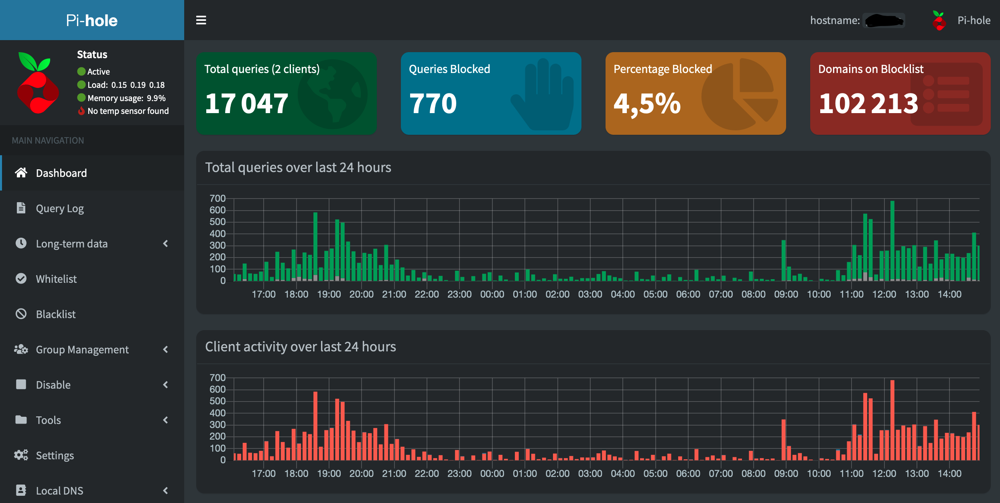

## 💬 What is this?
- **WirePiUS** is a combination of WireGuard, Pi-Hole, Unbound, and Stubby for secure VPN and DoT (DNS over TLS) in a docker-compose project
- **RaSoPle** is a combination of Radarr, Sonarr, Lidarr, Jackett, flaresolverr, rdt-client, Plex, Emby or Jellyfin in a one docker-compose project.

With the intent of enabling users to quickly and easily create and deploy a personally managed full or split-tunnel WireGuard VPN with ad blocking capabilities (via Pihole), first DNS caching with additional privacy options (via Unbound) and second DoT (DNS over TLS) within Stubby.

You can have access to all your Series, Movies, Music, EBook over secure VPN. Note that all services are not publically exposed, the idea is to guarantee the privacy and security.
## 👤 Author
* Twitter: [@belarbi2733](https://twitter.com/belarbi2733)
* Github: [@belarbi2733](https://github.com/belarbi2733)
## 🤝 Contributing

Contributions, issues and feature requests are welcome!<br />Feel free to check [issues page](https://github.com/belarbi2733/wirepius-radarr-sonarr/issues). 

## Show your support

Give a ⭐ if this project helped you!

<a href="https://www.buymeacoffee.com/belarbima" target="_blank"></a>

## 💻 Supported Architectures

This project supports multiple architectures such as `x86-64`, `arm64` [Raspberry-Ubuntu](https://ubuntu.com/download/raspberry-pi) and `armhf` [Raspberry-Raspbian](https://www.raspberrypi.com/software/operating-systems/).

**The architectures supported by this project are:**

| Architecture | Tag |
| :----: | --- |
| `x86-64` | `amd64-latest` |
| `arm64` | `arm64v8-latest` |
| `armhf` | `arm32v7-latest` |

## 🌉 WirePiUS
**WirePiUS** is a combination of [WireGuard®](https://www.wireguard.com/), [Pi-Hole®](https://en.wikipedia.org/wiki/Pi-hole), [Unbound®](https://en.wikipedia.org/wiki/Unbound_(DNS_server)), and [Stubby®](https://dnsprivacy.org/dns_privacy_daemon_-_stubby/) for secure VPN and [DoT](https://en.wikipedia.org/wiki/DNS_over_TLS) (DNS over TLS) in a docker-compose project

### 💪 Quickstart
To get started all you need to do is clone the repository and spin up the containers.
```bash
git clone https://github.com/belarbi2733/wirepius-radarr-sonarr
```
```bash
cd wirepius-radarr-sonarr/WirePiUS
```
```bash
docker-compose up -d
```
Within the output of the terminal will be QR codes you can (if you choose) to setup it WireGuard on your phone, or you can found the configs file in : `wirepius-radarr-sonarr/WireHoleS/wireguard`
```bash
wireguard    | **** Internal subnet is set to 10.6.0.0 ****
wireguard    | **** Peer DNS servers will be set to 10.2.0.100 ****
wireguard    | **** No found wg0.conf found (maybe an initial install), generating 1 server and 1 peer/client confs ****
wireguard    | PEER 1 QR code:
wireguard    | █████████████████████████████████████████████████████████████████
wireguard    | █████████████████████████████████████████████████████████████████
wireguard    | ████ ▄▄▄▄▄ █▀▀▀▄ ▀▀▀▀▄█ ██   ▄▀ ██ ██▄▀█    █▄▄█▀ ▄ ██ ▄▄▄▄▄ ████
wireguard    | ████ █   █ █▀▄█▀█▄█▄██▀▄   ▀▀██▀▄█ ▀▄█  ▀ █▀▄█▄ ▄▄▄ ██ █   █ ████
wireguard    | ████ █▄▄▄█ █▀█   ▀▀▄                               ▄██ █▄▄▄█ ████
wireguard    | ████▄▄▄▄▄▄▄█   ▀ ▀   █                         █▄█▄▀ █▄▄▄▄▄▄▄████
wireguard    | ████ ▄▄  █▄▄▄  ▄▀█▀▀▄    ▀█ ▀█  ▄  █▀▀▄▄██▄▄▀▀█▄ ██▀▀ █ █▄█ ▀████
wireguard    | █████  ▄█ ▄  ▀▀█▄▄  █▀ ▀ ▀ ▄  ▄ ▀▄▀▀█ ██ ▀██▀   ▀ ▀▀   ▀  ▀▄ ████
wireguard    | ████▀▀██  ▄▄▄ ██▀▄▄██▀ ██▀▄  ▀▀ █▄█   ▄ ▄█▄██   ▀▄▄█  █▀▀█ ▄▀████
wireguard    | ████ ▄█▀█▀▄▄   ▄███ ▄█ ▀▀▀▀█ ▄█ ▀▀▀▀▀▄ █   █ ███▄ █ ▄▄▄▄▀▀▀ █████
wireguard    | ████▀▄ ▀▀ ▄▄ ▄▄  █▀██    ▀▀▀▀▀  ▄  █▀▀██  ██▀   ▀█▄█▄█  ▄▄▀ ▀████
wireguard    | ████   ▀█ ▄▄                                          █  ▀▀██████
wireguard    | ███████  ▄▄█ █                                        ▄█▀█▀▀▄████
wireguard    | ████ ▄  █▄▄▀  ▄   ▀▄ █ ▄██▀▀█▀   █▄▄█▀▄█▀█▄ █ ▀▄█ ▄█ ▀   █  █████
wireguard    | ████▄██▀█▄▄ ▀ ▄▀                       ▀▄  ▄█ ▀▄  █▀ ▀██▀▄███████
wireguard    | ████ ▀█  ▄▄▄ ██▀███▄█▄█ █▄█▀ ▀ ▄▄▄ ▀▀  ▀▄ ▀▀█   █ █  ▄▄▄   ▄▀████
wireguard    | ████▄██  █▄█  █                                          ▀▀ ▀████
wireguard    | █████▀█▄▄▄▄▄ █▄ ▀▄ ██  ██▀ ▄ █▄ ▄▄▄▀ ▀▄▀█  █▀ █▄ ▄ ▄▄▄  ▄ ▀▄█████
wireguard    | █████▀▄▀  ▄▄█▄▀ ██▄▄▄    █▀  ██    ██ █▄   ██▄ ▄▀█▄██▀▄█   █▀████
wireguard    | ████▄   ▀ ▄ ▀ ▀▀▀▀▀▀█▀██▀ █  █▀█▀███ ▀▄█  █▄ █     ▀▀█▀██▀ ▄█████
wireguard    | ████ ▀ ▄   ██▄ ▀▀▀▄▀█  ▀▀▄ ▄ ▄  █▀▀▄█ ▄█▄▀█▄█▀ ▄▀█▄▀ ▀▀▀ ▀▀ ▀████
wireguard    | ███████ ▄█▄  ▀█▄▄  ▀█ █▀ █▀▄ ▄ ▀▄█▄▄█▀▄█▄▄▄▄█▀ ▀█ █▀  ▄ ██▀▄█████
wireguard    | ████▀█ █▀ ▄                                             █ ▄▀█████
wireguard    | ████▀▄ ▄▄█▄▄  ▄ ▄██▄ ▀ █ ▀ ▄▄█▀▀ ▄ ▀▀▄█▀▄██▀▀ ▄   ▄▄▄▄▀▀▄▀▀▀ ████
wireguard    | ████ ▀▄▄▀▀▄▀▀▀▄ ▄ █▄▄▀ ██▀▄▀ █▄██▀▀▄█▄▄█ ████▄ ▀█▄█▀▄▀ ▀▄ ▀ █████
wireguard    | ████ ▀ ▀▀▄▄ ▄ █▄ ▄ ██ ▄▀█▄▄  ▄ ▄ █▄▀ ▄▄▀██▄▀▀██▀▀▄▄ ▄   ██ ▄▀████
wireguard    | ██████████▄█▀▀█ ▄█ █▄▄ ▀▄▀█▀▀  ▄▄▄ ▀█▀█ ▄▀█▀█▀▀ ██▄▀ ▄▄▄ ▄██▄████
wireguard    | ████ ▄▄▄▄▄ █▄▄▄█▀▄█▀██ ▄ ▀█ ▀  █▄█ ▀▀█▄ ██▄█ ▀▄ ▀█▄▄ █▄█    █████
wireguard    | ████ █   █ █  ▄▄ ▄█   ▄▄█ █▀   ▄ ▄  █ ▄█▄▄█ █▀ ▄████ ▄▄  ▀▀▄▄████
wireguard    | ████ █▄▄▄█ █ ▀ ▄▄█ ▄ ▀▀▄██▄▀█▀█ █▀█▀▀▀▄   ▄ █▀▀▄▀ ▄▀███▀██▀██████
wireguard    | ████▄▄▄▄▄▄▄█▄██▄▄█▄▄▄▄▄██▄█▄▄▄█▄█▄█▄▄▄▄█▄▄▄█████▄▄█▄█▄▄████▄█████
wireguard    | █████████████████████████████████████████████████████████████████
wireguard    | █████████████████████████████████████████████████████████████████
wireguard    | [cont-init.d] 30-config: exited 0.
wireguard    | [cont-init.d] 99-custom-scripts: executing...
wireguard    | [custom-init] no custom files found exiting...
wireguard    | [cont-init.d] 99-custom-scripts: exited 0.
wireguard    | [cont-init.d] done.
wireguard    | [services.d] starting services
```
---

### Recommended configuration / Split tunnel:

Modify your wireguard client `AllowedIps` to `10.2.0.0/24` to only tunnel the web panel and DNS traffic.

---

### Access PiHole

While connected to WireGuard, navigate to http://10.2.0.100/admin

*The password (unless you set it in `docker-compose.yml`) is blank.*
<p align="center">
  
</p>

## 🌉 RaSoPle
**RaSoPle** is a combination of Radarr, Sonarr, Lidarr, Jackett, flaresolverr, rdt-client, Plex, Emby or Jellyfin in a one docker-compose project.

## :clap:  Supporters
[](https://github.com/belarbi2733/wirepius-radarr-sonarr)

<p align="center"><a href="https://github.com/belarbi2733/wirepius-radarr-sonarr"></a></p>
<br/>
<p align="center"><a href="https://github.com/belarbi2733/wirepius-radarr-sonarr#"></a></p>
