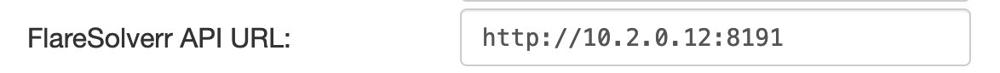
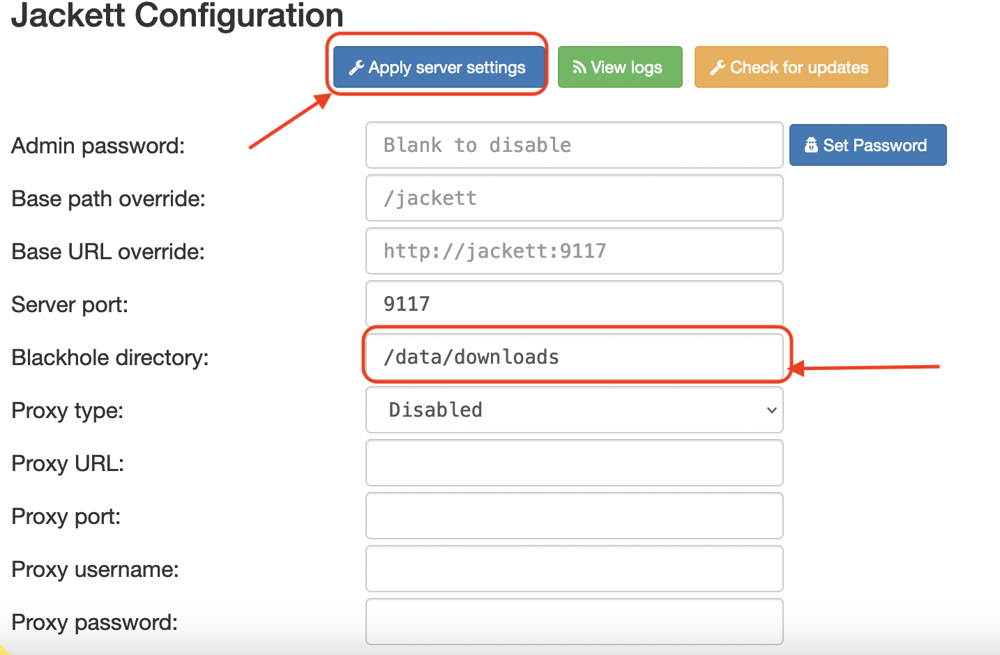

## 🌉 RaSoPle
**RaSoPle** is a combination of :
- [Radarr®](https://radarr.video/) is a movie collection manager for Usenet and BitTorrent users. It can monitor multiple RSS feeds for new movies and will interface with clients and indexers to grab, sort, and rename them. It can also be configured to automatically upgrade the quality of existing files in the library when a better quality format becomes available.
- [Sonarr®](https://sonarr.tv/) is a PVR for Usenet and BitTorrent users. It can monitor multiple RSS feeds for new episodes of your favorite shows and will grab, sort and rename them. It can also be configured to automatically upgrade the quality of files already downloaded when a better quality format becomes available.
- [Addarr®](https://github.com/Waterboy1602/Addarr) is a Telegram Bot made to add series to Sonarr or movies to Radarr with a couple of commands.
- [Plex®](https://www.plex.tv/) is a global streaming media service and a client–server media player platform, made by Plex, Inc. The Plex Media Server organizes video, audio, and photos from a user's collections and from online services, and streams it to the players. The official clients and unofficial third-party clients run on mobile devices, smart TVs, streaming boxes, and in web apps. 
- [Jackett®](https://github.com/Jackett/Jackett) works as a proxy server: it translates queries from apps ([Sonarr](https://github.com/Sonarr/Sonarr), [Radarr](https://github.com/Radarr/Radarr), [SickRage](https://sickrage.github.io/), [CouchPotato](https://couchpota.to/), [Mylar3](https://github.com/mylar3/mylar3), [Lidarr](https://github.com/lidarr/lidarr), [DuckieTV](https://github.com/SchizoDuckie/DuckieTV), [qBittorrent](https://www.qbittorrent.org/), [Nefarious](https://github.com/lardbit/nefarious) etc.) into tracker-site-specific http queries, parses the html or json response, and then sends results back to the requesting software. This allows for getting recent uploads (like RSS) and performing searches. Jackett is a single repository of maintained indexer scraping & translation logic - removing the burden from other apps.
- [Rdtclient®](https://github.com/rogerfar/rdt-client)  is a web interface to manage your torrents on [Real-Debrid](https://real-debrid.com/) or [AllDebrid](https://alldebrid.fr/).
- [Flaresolverr®](https://github.com/FlareSolverr/FlareSolverr) is a proxy server to bypass Cloudflare protection. FlareSolverr starts a proxy server and it waits for user requests in an idle state using few resources.
When some request arrives, it uses [puppeteer](https://github.com/puppeteer/puppeteer) with the
[stealth plugin](https://github.com/berstend/puppeteer-extra/tree/master/packages/puppeteer-extra-plugin-stealth)
to create a headless browser (Firefox). It opens the URL with user parameters and waits until the Cloudflare challenge
is solved (or timeout). The HTML code and the cookies are sent back to the user, and those cookies can be used to
bypass Cloudflare using other HTTP clients. 
### 💻 Supported Architectures

All the images supports multiple architectures such as `x86-64`, `arm64` and `armhf`.
### 🏗 Pre-Work
- You need to start **WireHoleS** before running **RaSoPle**
- Connect to **Wireguard**
- You need to create a Telegram Bot before, if you don't want use telegram Bot, use `docker-compose-no-bot.yml` instead of `docker-compose.yml`
### 💪 Quickstart
To get started all you need to do is clone the repository and spin up the containers.
```bash
git clone https://github.com/belarbi2733/wirehole-radarr-sonarr
```
```bash
cd wirehole-radarr-sonarr/RaSoPle
```
To use all services include Telegram Bot 
```bash
docker-compose up -d
```
To use all services without Telegram Bot 
```bash
docker-compose -f docker-compose-no-bot.yml up -d
```


### 🔧 Configuration
- **RealDebrid Client**
1. Browse to [http://10.2.0.10:6500](http://10.2.0.10:6500).
2. The first credentials you enter need to be remembered for future logins.
2. Click on `Settings` on the top and enter your Real-Debrid API key (found here: [https://real-debrid.com/apitoken](https://real-debrid.com/apitoken).
3. If you are using docker then the `Download path` setting needs to be the same as in your docker file mapping. By default this is `/data/downloads`.
4. Same goes for `Mapped path`, but this is the destination path from your docker mapping. This is a path on your host.
5. Save your settings.
- **Jackett**
1. Browse to [http://10.2.0.11:9117](http://10.2.0.11:9117).
2. Scroll down and add in section FlareSolverr API URL: [http://10.2.0.12:8191](http://10.2.0.12:8191) as shown :
<p align="center">
  
</p>

3. Apply changes by clicking on Apply server settings. You don't need to set a password as the service run over `wireguard` .
4. You can add Indexer for example : `YGGtorrent`
<p align="center">
  
</p>

- **Sonarr**
1. Browse to [http://10.2.0.13:8989](http://10.2.0.13:8989).
- **Radarr**
1. Browse to [http://10.2.0.14:7878](http://10.2.0.14:7878).
- **Plex**
1. Browse to [http://10.2.0.15:32400](http://10.2.0.14:32400).
- **Addarr**

